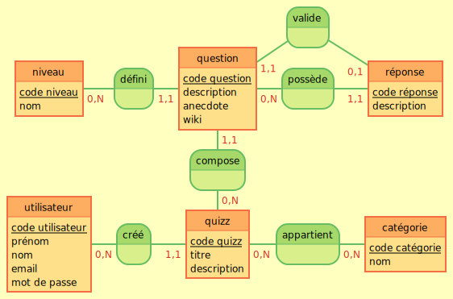

## Qu'est ce qu'un MCD ?

MCD = Modèle conceptuel de données

Représentation graphique de notre base de données et des liens entre les tables (relations et cardinalités)

- entités -> tables 
- propriétés -> champs de nos tables
- relations -> définies par des verbes à l'infinitif et qui vont représenter la façon dont 2 tables interagissent
- cardinalités -> occurence de chaque table dans la relation


### MCD au format Mocodo : 

```
:
:
valide, 11 question, 01 réponse

niveau: code niveau, nom
défini, 0N niveau, 11 question
question: code question, description, anecdote, wiki
possède, 0N question, 11 réponse
réponse: code réponse, description

compose, 11 question, 0N quizz

utilisateur: code utilisateur, prénom, nom, email, mot de passe
créé, 0N utilisateur, 11 quizz
quizz: code quizz, titre, description
appartient, 0N quizz, 0N catégorie
catégorie : code catégorie, nom
```

### MCD Diagramme


